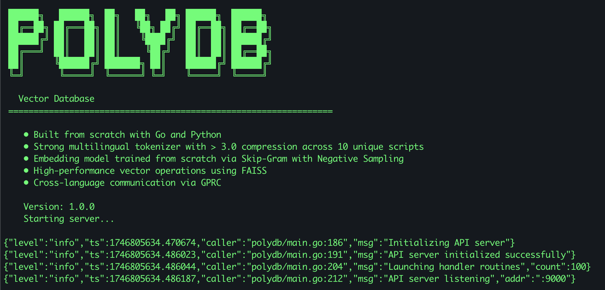

# PolyDB 📦

PolyDB is a high-performance vector database built entirely from scratch in Go and Python.



## Core Features ✨

- **Multilingual Tokenizer**: Achieves over 3.0 compression across 10 unique scripts, ensuring efficient storage and retrieval of multilingual data.
- **Custom Embedding Model**: Built from scratch using the Skip-Gram model with Negative Sampling, providing high-quality vector representations.
- **High-Performance Vector Operations**: Utilizes FAISS for fast and efficient vector operations, making it suitable for large-scale data processing.
- **Cross-Language Communication**: Implements gRPC for seamless communication between different language components, enhancing interoperability.
- **Modular Architecture**: Organized under `polyvec` and `polyglot` directories, each representing distinct functionalities for better modularity and scalability.

## Project Structure 🗂️

- `src/polyvec`: Contains the core vector processing functionalities, including training scripts and protocol buffers for embeddings.
- `src/polyglot`: Houses the multilingual processing components, such as tokenizers and normalization tools.
- `src/apiserver`: Manages the API server components, facilitating external interactions with the database.
- `tests`: Includes test cases to ensure the system's reliability and correctness.

```
polydb/
├── main.go                       # Main application entry point, sets up HTTP server and routes
├── go.mod                        # Go module dependencies
├── go.sum                        # Go module checksums
├── src/
│   ├── polyvec/                  # Vector processing module
│   │   ├── data/
│   │   │   ├── sgns.py           # Skip-Gram with Negative Sampling implementation for embeddings
│   │   │   └── util.py           # Utility functions for data processing and S3 operations
│   │   ├── pgrpc/
│   │   │   └── grpc_server.py    # gRPC server for Python vector operations
│   │   ├── proto/
│   │   │   ├── embeddings.proto  # Protocol buffer definition for embedding service
│   │   │   └── tokenizer.proto   # Protocol buffer definition for tokenizer service
│   │   └── train/
│   │       ├── embeddings.py     # Embedding model definition and utility functions
│   │       └── train.py          # Training script for the embedding model
│   ├── polyglot/                 # Multilingual processing module
│   │   ├── bpe/
│   │   │   ├── bpe.go            # Byte-Pair Encoding implementation
│   │   │   ├── data.go           # Data structures for BPE operations
│   │   │   ├── route.go          # HTTP routing for BPE service
│   │   │   ├── translation.go    # Translation utilities for multilingual support
│   │   │   └── utils.go          # Utility functions for BPE processing
│   │   ├── normalize/
│   │   │   └── normalize.go      # Text normalization for different languages
│   │   ├── proto/
│   │   │   └── tokenizer.proto   # Protocol buffer definition for tokenizer
│   │   ├── server/
│   │   │   └── server.go         # HTTP server implementation for polyglot
│   │   ├── tgrpc/
│   │   │   ├── server.go         # gRPC server implementation for tokenizer
│   │   │   └── tgrpc.go          # gRPC client utilities for tokenizer
│   │   └── main.go               # Entry point for the polyglot service
│   ├── apiserver/                # API server module
│   │   ├── agrpc/
│   │   │   └── agrpc.go          # gRPC client for API server
│   │   ├── find_similar.go       # Implementation of similarity search functionality
│   │   └── insert.go             # Implementation of vector insertion functionality
│   └── storage/                  # Storage module
│       └── storage.py            # Interface for vector storage operations using FAISS
└── tests/                        # Contains test cases for the system
```

## Components 🛠️

### Polyvec
Polyvec is the vector processing service that utilizes FAISS to perform insert and search operations efficiently. It also exposes a training interface in PyTorch to demonstrate the implementation of the Skip-Gram with Negative Sampling (SGNS). Training data was generated in a distributed fashion from 10 independent machines and uploaded to Amazon S3. At training time, this data was loaded into memory in batches during each epoch.

### Polyglot
Polyglot is a comprehensive tokenizer that effectively compresses data across 10 languages: English, Hebrew, Bengali, Vietnamese, Korean, Arabic, Russian, Thai, Chinese, and Japanese. Polyglot operates as a standalone service and can be found at [Polyglot GitHub Repository](https://github.com/VenkatRamaraju/polyglot).

### API Server
PolyDB is driven by a Go-based API server designed to handle large workloads with sufficient resource protection. The request ingress load is buffered by go channels that store requests until a processor routine is available to handle them.

## Getting Started 🚀

### Installation 🛠️

1. Clone the repository:
   ```bash
   git clone https://github.com/yourusername/polydb.git
   ```

   ```bash
   cd polydb
   ```

2. Install Go dependencies:
   ```bash
   go mod tidy
   ```

3. Set up the Python environment:
   ```bash
   conda env create -f src/polyvec/environment.yml
   ```

   ```bash
   conda activate polyvec
   ```

   ```bash
   conda install conda-forge::faiss-cpu
   ```

   ```bash
   pip install -r src/polyvec/requirements.txt
   ```

### Usage 🖥️

To use PolyDB, you need to start two components in the following order:

1. Start the gRPC embeddings server:
   ```bash
   python src/polyvec/pgrpc/grpc_server.py
   ```

   **Note:** During the server's initialization, the weights of the embedding model are pulled into memory from an S3 bucket. The `train.py` file generates the embedding model weights from the raw dataset. To keep this repository light, the direct weights of the embedding matrix are not included in this repository.

2. In a new terminal, start the main application:
   ```bash
   go run main.go
   ```

3. The API server will be available at `http://localhost:9000` and you can interact with it using HTTP requests:
   ```bash
   curl -X POST http://localhost:9000/insert -H "Content-Type: application/json" -d '{"text":"This is a sample text"}'
   ```
   ```bash
   curl -X POST http://localhost:9000/find_similar -H "Content-Type: application/json" -d '{"text":"Sample query text", "top_k": 5}'
   ```

## Training 🏋️ 

- **Dataset:** The embedding was trained on 10M sentences from the [opus-100 dataset](https://huggingface.co/datasets/Helsinki-NLP/opus-100), with 1M sentences per language. The language set was carefully selected to incorporate a sufficiently diverse range of scripts in our training dataset.
- **Implementation:** The skip-gram with negative sampling algorithm was run for all sentences in the dataset, generating triplets: `(center, context, [negative])` and uploaded to S3. The embedding model training policy optimized for high mean context affinity and low mean negative pair affinity.

## License 📄

This project is licensed under the MIT License.
